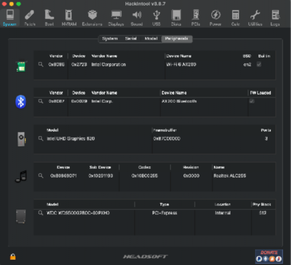
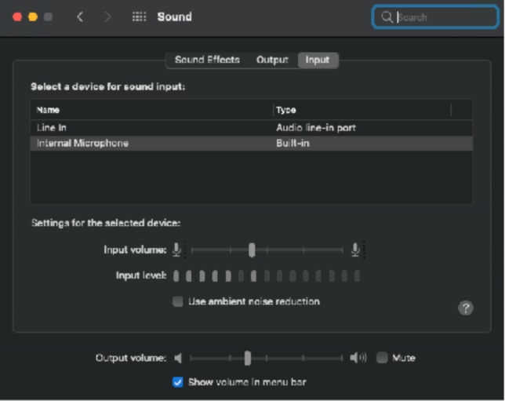
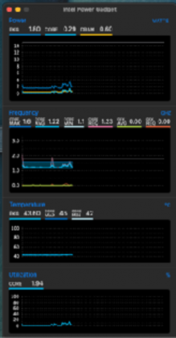
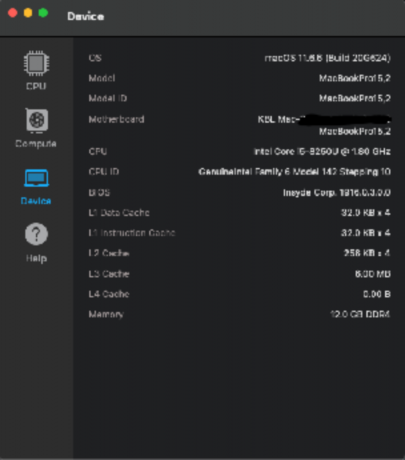

<!DOCTYPE  html PUBLIC "-//W3C//DTD XHTML 1.0 Transitional//EN" "http://www.w3.org/TR/xhtml1/DTD/xhtml1-transitional.dtd">
<html xmlns="http://www.w3.org/1999/xhtml"><head><meta http-equiv="Content-Type" content="text/html; charset=utf-8"/>
</head><body><h1 style="padding-top: 3pt;padding-left: 5pt;text-indent: 0pt;text-align: left;">Acer A515-51 Laptop Hackintosh.</h1>
 

This laptop comes with the following specifications.
<ul id="l1"><li>
Core i5 8250U Kabylake refresh.
</li><li>
4GB of RAM.
</li><li>
1TB 5400rpm Harddisk.
</li><li>
UHD620 Graphics no DGPU, HDMI out.
</li><li>
Qualcomm WiFi.
</li><li>
i2C trackpad and PS2 keyboard.
</li><li>
ALC255 Audio codec, Mic array, 3.5mm jack.
</li><li>
Realtek SD card Reader.
</li><li>
USB camera.
</li><li>
48WH battery.

 

## Of which suggested upgrades,
</li><li>
Qualcomm WiFi to intel AX200, 201 etc.
</li><li>
Upgrade RAM to at least 8GB.
</li><li>
Upgrade or install extra NVME SSD of suitable size.

 

All of the components Work.
<table style="border-collapse:collapse;margin-left:5.94292pt" cellspacing="0"><tr style="height:23pt"><td style="width:161pt;border-top-style:solid;border-top-width:1pt;border-top-color:#A6A6A6;border-left-style:solid;border-left-width:1pt;border-left-color:#A6A6A6;border-bottom-style:solid;border-bottom-width:1pt;border-bottom-color:#A6A6A6;border-right-style:solid;border-right-width:1pt;border-right-color:#A6A6A6">
Part
</td><td style="width:68pt;border-top-style:solid;border-top-width:1pt;border-top-color:#A6A6A6;border-left-style:solid;border-left-width:1pt;border-left-color:#A6A6A6;border-bottom-style:solid;border-bottom-width:1pt;border-bottom-color:#A6A6A6;border-right-style:solid;border-right-width:1pt;border-right-color:#A6A6A6">
Working
</td><td style="width:253pt;border-top-style:solid;border-top-width:1pt;border-top-color:#A6A6A6;border-left-style:solid;border-left-width:1pt;border-left-color:#A6A6A6;border-bottom-style:solid;border-bottom-width:1pt;border-bottom-color:#A6A6A6;border-right-style:solid;border-right-width:1pt;border-right-color:#A6A6A6">
Notes
</td></tr><tr style="height:23pt"><td style="width:161pt;border-top-style:solid;border-top-width:1pt;border-top-color:#A6A6A6;border-left-style:solid;border-left-width:1pt;border-left-color:#A6A6A6;border-bottom-style:solid;border-bottom-width:1pt;border-bottom-color:#A6A6A6;border-right-style:solid;border-right-width:1pt;border-right-color:#A6A6A6" bgcolor="#F5F5F5">
Processor
</td><td style="width:68pt;border-top-style:solid;border-top-width:1pt;border-top-color:#A6A6A6;border-left-style:solid;border-left-width:1pt;border-left-color:#A6A6A6;border-bottom-style:solid;border-bottom-width:1pt;border-bottom-color:#A6A6A6;border-right-style:solid;border-right-width:1pt;border-right-color:#A6A6A6" bgcolor="#F5F5F5">
Yes
</td><td style="width:253pt;border-top-style:solid;border-top-width:1pt;border-top-color:#A6A6A6;border-left-style:solid;border-left-width:1pt;border-left-color:#A6A6A6;border-bottom-style:solid;border-bottom-width:1pt;border-bottom-color:#A6A6A6;border-right-style:solid;border-right-width:1pt;border-right-color:#A6A6A6" bgcolor="#F5F5F5">
Works and Intelx86 plugin attaches correctly
</td></tr><tr style="height:23pt"><td style="width:161pt;border-top-style:solid;border-top-width:1pt;border-top-color:#A6A6A6;border-left-style:solid;border-left-width:1pt;border-left-color:#A6A6A6;border-bottom-style:solid;border-bottom-width:1pt;border-bottom-color:#A6A6A6;border-right-style:solid;border-right-width:1pt;border-right-color:#A6A6A6">
Graphics
</td><td style="width:68pt;border-top-style:solid;border-top-width:1pt;border-top-color:#A6A6A6;border-left-style:solid;border-left-width:1pt;border-left-color:#A6A6A6;border-bottom-style:solid;border-bottom-width:1pt;border-bottom-color:#A6A6A6;border-right-style:solid;border-right-width:1pt;border-right-color:#A6A6A6">
Yes
</td><td style="width:253pt;border-top-style:solid;border-top-width:1pt;border-top-color:#A6A6A6;border-left-style:solid;border-left-width:1pt;border-left-color:#A6A6A6;border-bottom-style:solid;border-bottom-width:1pt;border-bottom-color:#A6A6A6;border-right-style:solid;border-right-width:1pt;border-right-color:#A6A6A6">
Yes, by emulating other device ID.
</td></tr><tr style="height:23pt"><td style="width:161pt;border-top-style:solid;border-top-width:1pt;border-top-color:#A6A6A6;border-left-style:solid;border-left-width:1pt;border-left-color:#A6A6A6;border-bottom-style:solid;border-bottom-width:1pt;border-bottom-color:#A6A6A6;border-right-style:solid;border-right-width:1pt;border-right-color:#A6A6A6" bgcolor="#F5F5F5">
Storage
</td><td style="width:68pt;border-top-style:solid;border-top-width:1pt;border-top-color:#A6A6A6;border-left-style:solid;border-left-width:1pt;border-left-color:#A6A6A6;border-bottom-style:solid;border-bottom-width:1pt;border-bottom-color:#A6A6A6;border-right-style:solid;border-right-width:1pt;border-right-color:#A6A6A6" bgcolor="#F5F5F5">
Yes
</td><td style="width:253pt;border-top-style:solid;border-top-width:1pt;border-top-color:#A6A6A6;border-left-style:solid;border-left-width:1pt;border-left-color:#A6A6A6;border-bottom-style:solid;border-bottom-width:1pt;border-bottom-color:#A6A6A6;border-right-style:solid;border-right-width:1pt;border-right-color:#A6A6A6" bgcolor="#F5F5F5">
Using NVME fixup for SSD.
</td></tr><tr style="height:23pt"><td style="width:161pt;border-top-style:solid;border-top-width:1pt;border-top-color:#A6A6A6;border-left-style:solid;border-left-width:1pt;border-left-color:#A6A6A6;border-bottom-style:solid;border-bottom-width:1pt;border-bottom-color:#A6A6A6;border-right-style:solid;border-right-width:1pt;border-right-color:#A6A6A6">
Keyboard
</td><td style="width:68pt;border-top-style:solid;border-top-width:1pt;border-top-color:#A6A6A6;border-left-style:solid;border-left-width:1pt;border-left-color:#A6A6A6;border-bottom-style:solid;border-bottom-width:1pt;border-bottom-color:#A6A6A6;border-right-style:solid;border-right-width:1pt;border-right-color:#A6A6A6">
Yes
</td><td style="width:253pt;border-top-style:solid;border-top-width:1pt;border-top-color:#A6A6A6;border-left-style:solid;border-left-width:1pt;border-left-color:#A6A6A6;border-bottom-style:solid;border-bottom-width:1pt;border-bottom-color:#A6A6A6;border-right-style:solid;border-right-width:1pt;border-right-color:#A6A6A6">
Using Voodoo PS2
</td></tr><tr style="height:23pt"><td style="width:161pt;border-top-style:solid;border-top-width:1pt;border-top-color:#A6A6A6;border-left-style:solid;border-left-width:1pt;border-left-color:#A6A6A6;border-bottom-style:solid;border-bottom-width:1pt;border-bottom-color:#A6A6A6;border-right-style:solid;border-right-width:1pt;border-right-color:#A6A6A6" bgcolor="#F5F5F5">
Trackpad, Multi touch.
</td><td style="width:68pt;border-top-style:solid;border-top-width:1pt;border-top-color:#A6A6A6;border-left-style:solid;border-left-width:1pt;border-left-color:#A6A6A6;border-bottom-style:solid;border-bottom-width:1pt;border-bottom-color:#A6A6A6;border-right-style:solid;border-right-width:1pt;border-right-color:#A6A6A6" bgcolor="#F5F5F5">
Yes
</td><td style="width:253pt;border-top-style:solid;border-top-width:1pt;border-top-color:#A6A6A6;border-left-style:solid;border-left-width:1pt;border-left-color:#A6A6A6;border-bottom-style:solid;border-bottom-width:1pt;border-bottom-color:#A6A6A6;border-right-style:solid;border-right-width:1pt;border-right-color:#A6A6A6" bgcolor="#F5F5F5">
Using Voodoo i2C and I2C aml
</td></tr><tr style="height:32pt"><td style="width:161pt;border-top-style:solid;border-top-width:1pt;border-top-color:#A6A6A6;border-left-style:solid;border-left-width:1pt;border-left-color:#A6A6A6;border-bottom-style:solid;border-bottom-width:1pt;border-bottom-color:#A6A6A6;border-right-style:solid;border-right-width:1pt;border-right-color:#A6A6A6">
Audio
</td><td style="width:68pt;border-top-style:solid;border-top-width:1pt;border-top-color:#A6A6A6;border-left-style:solid;border-left-width:1pt;border-left-color:#A6A6A6;border-bottom-style:solid;border-bottom-width:1pt;border-bottom-color:#A6A6A6;border-right-style:solid;border-right-width:1pt;border-right-color:#A6A6A6">
Yes
</td><td style="width:253pt;border-top-style:solid;border-top-width:1pt;border-top-color:#A6A6A6;border-left-style:solid;border-left-width:1pt;border-left-color:#A6A6A6;border-bottom-style:solid;border-bottom-width:1pt;border-bottom-color:#A6A6A6;border-right-style:solid;border-right-width:1pt;border-right-color:#A6A6A6">
Using Apple ALC and Combo Jack fix, Headset mic works as well.
</td></tr><tr style="height:23pt"><td style="width:161pt;border-top-style:solid;border-top-width:1pt;border-top-color:#A6A6A6;border-left-style:solid;border-left-width:1pt;border-left-color:#A6A6A6;border-bottom-style:solid;border-bottom-width:1pt;border-bottom-color:#A6A6A6;border-right-style:solid;border-right-width:1pt;border-right-color:#A6A6A6" bgcolor="#F5F5F5">
HDMI
</td><td style="width:68pt;border-top-style:solid;border-top-width:1pt;border-top-color:#A6A6A6;border-left-style:solid;border-left-width:1pt;border-left-color:#A6A6A6;border-bottom-style:solid;border-bottom-width:1pt;border-bottom-color:#A6A6A6;border-right-style:solid;border-right-width:1pt;border-right-color:#A6A6A6" bgcolor="#F5F5F5">
Yes
</td><td style="width:253pt;border-top-style:solid;border-top-width:1pt;border-top-color:#A6A6A6;border-left-style:solid;border-left-width:1pt;border-left-color:#A6A6A6;border-bottom-style:solid;border-bottom-width:1pt;border-bottom-color:#A6A6A6;border-right-style:solid;border-right-width:1pt;border-right-color:#A6A6A6" bgcolor="#F5F5F5">
Using proper connector patches.
</td></tr><tr style="height:23pt"><td style="width:161pt;border-top-style:solid;border-top-width:1pt;border-top-color:#A6A6A6;border-left-style:solid;border-left-width:1pt;border-left-color:#A6A6A6;border-bottom-style:solid;border-bottom-width:1pt;border-bottom-color:#A6A6A6;border-right-style:solid;border-right-width:1pt;border-right-color:#A6A6A6">
Cardreader
</td><td style="width:68pt;border-top-style:solid;border-top-width:1pt;border-top-color:#A6A6A6;border-left-style:solid;border-left-width:1pt;border-left-color:#A6A6A6;border-bottom-style:solid;border-bottom-width:1pt;border-bottom-color:#A6A6A6;border-right-style:solid;border-right-width:1pt;border-right-color:#A6A6A6">
Yes
</td><td style="width:253pt;border-top-style:solid;border-top-width:1pt;border-top-color:#A6A6A6;border-left-style:solid;border-left-width:1pt;border-left-color:#A6A6A6;border-bottom-style:solid;border-bottom-width:1pt;border-bottom-color:#A6A6A6;border-right-style:solid;border-right-width:1pt;border-right-color:#A6A6A6">
Using Sinetek-rtsx
</td></tr><tr style="height:23pt"><td style="width:161pt;border-top-style:solid;border-top-width:1pt;border-top-color:#A6A6A6;border-left-style:solid;border-left-width:1pt;border-left-color:#A6A6A6;border-bottom-style:solid;border-bottom-width:1pt;border-bottom-color:#A6A6A6;border-right-style:solid;border-right-width:1pt;border-right-color:#A6A6A6" bgcolor="#F5F5F5">
Battery
</td><td style="width:68pt;border-top-style:solid;border-top-width:1pt;border-top-color:#A6A6A6;border-left-style:solid;border-left-width:1pt;border-left-color:#A6A6A6;border-bottom-style:solid;border-bottom-width:1pt;border-bottom-color:#A6A6A6;border-right-style:solid;border-right-width:1pt;border-right-color:#A6A6A6" bgcolor="#F5F5F5">
Yes
</td><td style="width:253pt;border-top-style:solid;border-top-width:1pt;border-top-color:#A6A6A6;border-left-style:solid;border-left-width:1pt;border-left-color:#A6A6A6;border-bottom-style:solid;border-bottom-width:1pt;border-bottom-color:#A6A6A6;border-right-style:solid;border-right-width:1pt;border-right-color:#A6A6A6" bgcolor="#F5F5F5">
Using Virtual SMC
</td></tr><tr style="height:23pt"><td style="width:161pt;border-top-style:solid;border-top-width:1pt;border-top-color:#A6A6A6;border-left-style:solid;border-left-width:1pt;border-left-color:#A6A6A6;border-bottom-style:solid;border-bottom-width:1pt;border-bottom-color:#A6A6A6;border-right-style:solid;border-right-width:1pt;border-right-color:#A6A6A6">
Media, Brightness keys.
</td><td style="width:68pt;border-top-style:solid;border-top-width:1pt;border-top-color:#A6A6A6;border-left-style:solid;border-left-width:1pt;border-left-color:#A6A6A6;border-bottom-style:solid;border-bottom-width:1pt;border-bottom-color:#A6A6A6;border-right-style:solid;border-right-width:1pt;border-right-color:#A6A6A6">
Yes
</td><td style="width:253pt;border-top-style:solid;border-top-width:1pt;border-top-color:#A6A6A6;border-left-style:solid;border-left-width:1pt;border-left-color:#A6A6A6;border-bottom-style:solid;border-bottom-width:1pt;border-bottom-color:#A6A6A6;border-right-style:solid;border-right-width:1pt;border-right-color:#A6A6A6">
Using PNLF, Brightness fix.
</td></tr></table>
 

Works like regular Mac Almost.
<h2 style="padding-top: 3pt;padding-left: 81pt;text-indent: 0pt;text-align: center;"><a name="bookmark0">How to go about the Installation then?</a></h2>
Download the files in the repo and prepare the Installation drive as per the Opencore Guide, hope it goes well.

Things to keep in mind.
</li><li>
Turmoff Secure boot in bios.
</li><li>
Turn off CFG lock by enabling advanced options in bios.(See below)
</li><li>
Make sure you are running the latest bios update.
</li><li>
Copy the latest kexts if required and add to config.
<h3 style="padding-top: 9pt;padding-left: 5pt;text-indent: 0pt;line-height: 19pt;text-align: left;">How to enable advance options Inside bios?</h3></li><li>
Go to bios by pressing F2 during device start.
</li><li>
Now after entering bios press power button and hold till the device shuts down.
</li><li>
After the device is off press the keys in this order,
</li><li>
F4,4,R,F,V,F5,5,T,G,B,F6,6,Y,H,N.
</li><li>
Now press power button and go to bios immediately.
</li><li>
Voila, here’s your advanced settings tab additional to the normal advanced one.
</li></ul>
 

Geekbench results <u>CPU.</u>

Compute.

 

 

 

Hackintool

 

Audio

	

Intelpower Gadget Geekbench
</body></html>
